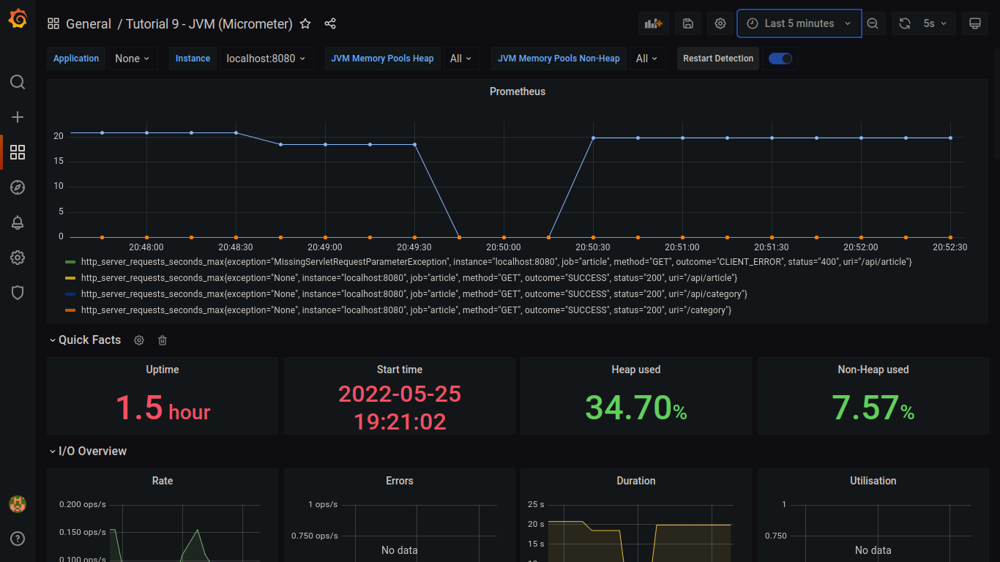
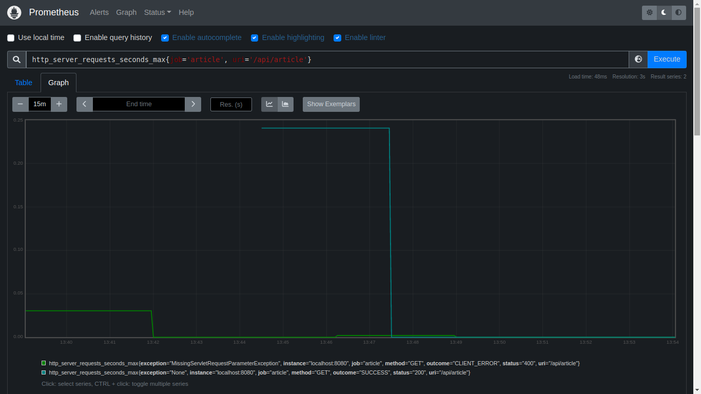
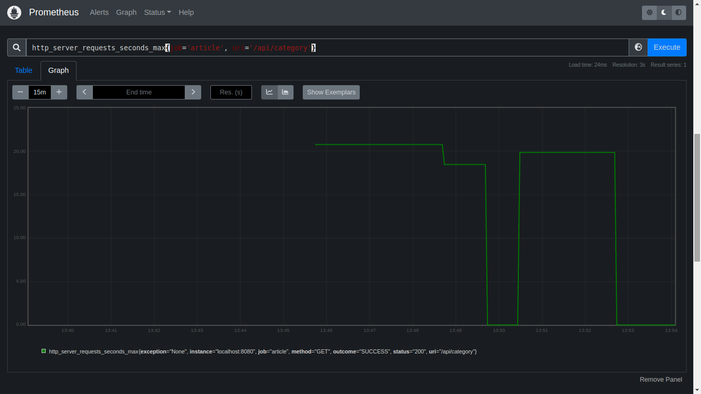
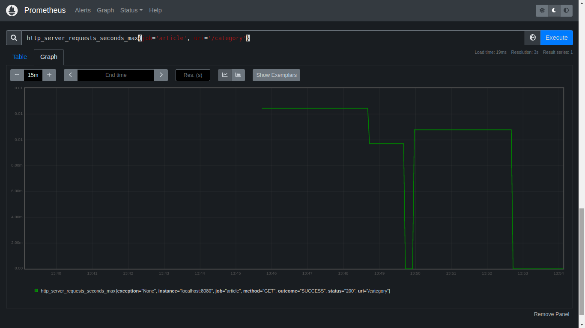

# Tutorial 9

> Done by Muhammad Athallah, 2022.

1. Bagaimana mengatur Grafana agar menampilkan data Prometheus?

Jawaban: Untuk mendapatkan data dari Prometheus, kita perlu menambahkan _data source_. Pilih menu `Configuration -> Data sources` kemudian pilih `Add data source`. Pilih opsi Prometheus dan isi URL dengan URL Prometheus (`http://localhost:9090`). Klik `Save & test` untuk menyimpan dan mengecek apakah data Prometheus berhasil diambil oleh Grafana.

2. Berdasarkan hasil Profiling yang Anda dapatkan, jelaskan analisis Anda terhadap keadaan aplikasi saat ini.

Jawaban: Aplikasi berjalan dengan benar, namun terlambat dalam mendapatkan daftar kategori. Hal ini dikarenakan oleh cara mendapatkan "artikel yang paling baru" yang kurang efisien.

3. Bagaimana Anda mengintepretasikan temuan Anda? Jelaskan dan berikan gambar screenshot setiap graph query yang Anda dapatkan dari dashboard Prometheus dan Grafana.

Jawaban: Berikut adalah tangkapan layar dari operasi yang saya lakukan untuk mendapatkan waktu eksekusi maksimum dari setiap endpoint yang ada.

Dapat dilihat bahwa endpoint '/api/category' merupakan endpoint yang memiliki waktu eksekusi terlambat dibandingkan endpoint lainnya.